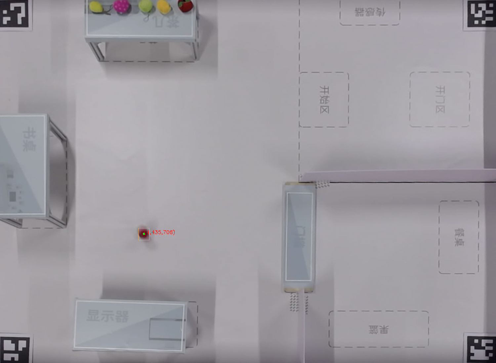
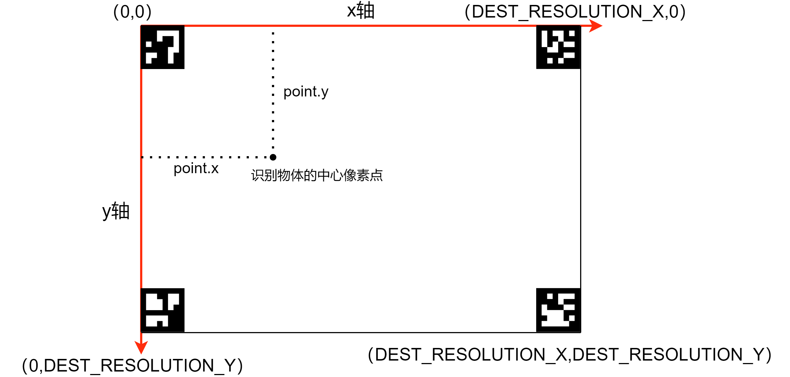

# Artag定位接口文档

HAP-JS：Artag定位接口

```javascript
artagLocating(): coordinate;
```

artagLocating()方法接收udp包解析成图片，进行artag定位，返回机器人位置坐标。

## 返回值

`coordinate`

  string类型，检测到机器人的位置坐标。

坐标系与场地平面图的对应关系：


检测图片（输出可选）





## 完整示例代码

HAP-Service Ability service.js示例代码：

```javascript
import artag from '@ohos.artag'

export default {
    async onStart(want)
    {
        console.info('[HIT]ServiceAbility onStart');
        console.info('[HIT]ServiceAbility onStart end');
    },
    onStop()
    {
        console.info('[HIT]ServiceAbility onStop');
    },
    onConnect(want)
    {
        console.info('[HIT]ServiceAbility onConnect');
        return {};
    },
    onReconnect(want)
    {
        console.info('[HIT]ServiceAbility onReconnect');
    },
    onDisconnect()
    {
        console.info('[HIT]ServiceAbility onDisconnect');
    },
    onCommand(want, restart, startId)
    {
        console.info('[HIT]ServiceAbility onCommand');

//        artag定位
        let coor = artag.artagLocating();
        console.info('[HIT] coordinate is: ' + coor);

        console.info('[HIT]ServiceAbility onCommand end');
    }
};
```

