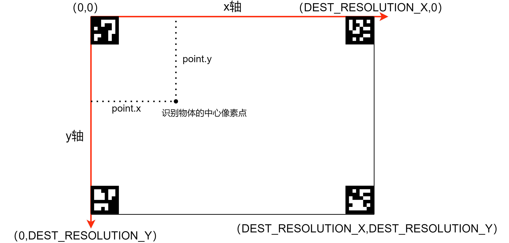
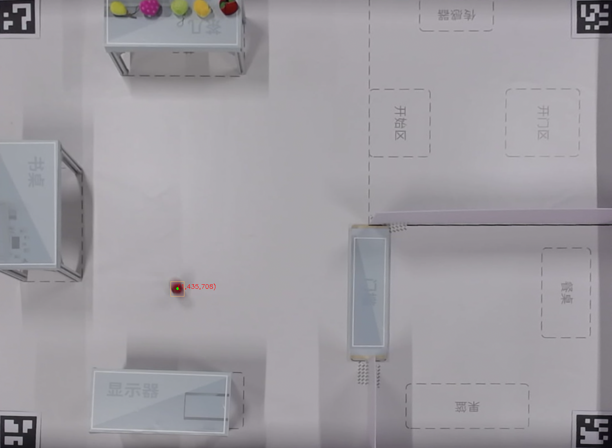

# Artag定位接口文档

HAP-JS：Artag定位模块接口

## getBackgroundImage

```
getBackgroundImage(): result;
```

getBackgroundImage()方法接收udp包传来的背景图片，设定为基准图片。

**返回值**

`result`

  int类型。0表示接收udp并解析成图片正确，-1表示出错。

示例背景图片为：


## getBackgroundImageFromFile

```
getBackgroundImageFromFile(): result;
```

getBackgroundImageFromFile()方法从固定路径"/data/storage/el2/base/haps/artag/background.jpg"下读取已做过去畸变处理的背景图片（该路径对应的物理路径为/data/app/el2/100/base/napi.test/haps/artag/background.jpg），设定为基准图片。

**返回值**

`result`

  int类型。0表示背景图片成功读取，-1表示出错。

## artagLocating

```javascript
artagLocating(): coordinate;
```

artagLocating()方法接收udp包传来的测试图片，进行artag定位，返回机器人位置坐标。

**返回值**

`coordinate`

  string类型，检测到机器人的位置坐标。

坐标系与场地平面图的对应关系：




通过设置artag.h中宏IS_WRITE_IMG为true，将会向固定目录输出裁剪后的检测图片

> 可选输出检测图片的路径为/data/app/el2/100/base/napi.test/haps/artag，注意需要提前新建artag目录并修改用户与用户组



## 完整示例代码

HAP-Service Ability service.js示例代码：

```javascript
import artag from '@ohos.artag'

export default {
    async onStart(want)
    {
        console.info('[HIT]ServiceAbility onStart');
        console.info('[HIT]ServiceAbility onStart end');
    },
    onStop()
    {
        console.info('[HIT]ServiceAbility onStop');
    },
    onConnect(want)
    {
        console.info('[HIT]ServiceAbility onConnect');
        return {};
    },
    onReconnect(want)
    {
        console.info('[HIT]ServiceAbility onReconnect');
    },
    onDisconnect()
    {
        console.info('[HIT]ServiceAbility onDisconnect');
    },
    onCommand(want, restart, startId)
    {
        console.info('[HIT]ServiceAbility onCommand');

//        artag定位
        // udp获得背景图片
        //let res = artag.getBackgroundImage();
        //if (res !== 0) {
        //console.info('[HIT] get background image error');
        //}
        
        // 本地读取背景图片
        let res = artag.getBackgroundImageFromFile();
        if (res !== 0) {
        console.info('[HIT] get background image error');
        }
        
        let coor = artag.artagLocating();
        console.info('[HIT] coordinate is: ' + coor);

        console.info('[HIT]ServiceAbility onCommand end');
    }
};
```

