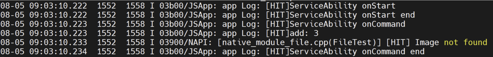
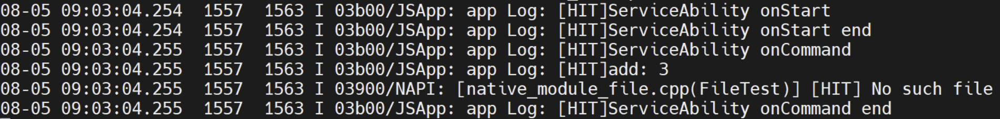
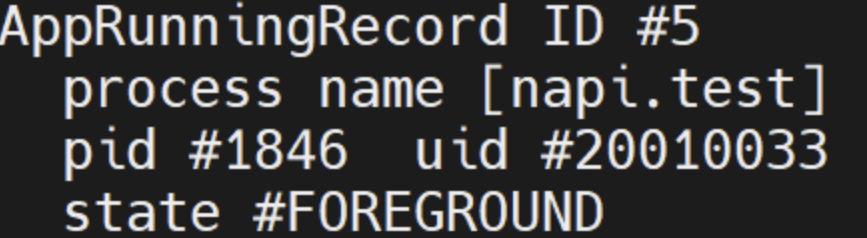

# Native API读文件失败问题描述
- [Native API读文件失败问题描述](#native-api读文件失败问题描述)
  - [环境](#环境)
  - [测试](#测试)
    - [1.OpenCV函数imread()读图片测试](#1opencv函数imread读图片测试)
    - [2.文件打开读取测试函数](#2文件打开读取测试函数)
  - [尝试解决](#尝试解决)

## 环境

- OS：OpenHarmony3.1 release

- NAPI动态库：Native API模块开发（开发语言C++）

  - 模块位置：//foundation/ace/napi/sample/native_module_file/

  > 开发方式参考：[zh-cn/application-dev/napi/napi-guidelines.md · OpenHarmony/docs - Gitee.com](https://gitee.com/openharmony/docs/blob/master/zh-cn/application-dev/napi/napi-guidelines.md)

- Service Ability开发（开发语言JS）
  - IDE：DevEco Studio 3.0 Beta2
  - OpenHarmony SDK：API Version 7

## 测试

### 1.OpenCV函数imread()读图片测试

C++ NAPI模块关键函数实现：

```cpp
Mat image = imread("/data/bus.jpg");    // 路径"/bus.jpg"也测试过
// Error Handling
if (image.empty()) {
    HILOG_INFO("[HIT] Image not found");
    return 0;
}
HILOG_INFO("[HIT] Image found");
```

运行相应的Service Ability结果如下：



### 2.文件打开读取测试函数

C++ NAPI模块关键函数实现：

```cpp
// read file
fstream my_file1;
my_file1.open("/my_file", ios::in);
if (!my_file1) {
    HILOG_INFO("[HIT] No such file");
}
else {
    string ch;

    while (1) {
        my_file1 >> ch;
        if (my_file1.eof())
            break;

        HILOG_INFO("[HIT] %{public}s", ch.c_str());
    }

}
my_file1.close();
```

运行相应的Service Ability结果如下：



## 尝试解决

- 修改读写目录的用户与用户组与Service Ability相同（20020033），测试失败

  

附：

Service Ability JS代码:

```javascript
import demo from '@ohos.demo'
import file from '@ohos.file'

export default {
    async onStart(want)
    {
        console.info('[HIT]ServiceAbility onStart');
        console.info('[HIT]ServiceAbility onStart end');
    },
    onStop()
    {
        console.info('[HIT]ServiceAbility onStop');
    },
    onConnect(want)
    {
        console.info('[HIT]ServiceAbility onConnect');
        return {};
    },
    onReconnect(want)
    {
        console.info('[HIT]ServiceAbility onReconnect');
    },
    onDisconnect()
    {
        console.info('[HIT]ServiceAbility onDisconnect');
    },
    onCommand(want, restart, startId)
    {
        console.info('[HIT]ServiceAbility onCommand');
        console.info('[HIT]add: ' + demo.add(1, 2));   // napi基础测试
        file.file_test();
        console.info('[HIT]ServiceAbility onCommand end')
    }
};
```

Service Ability安装运行：

```bash
bm install -p file.hap
hilog -r   // 之前运行过该Service Ability
aa start -a napi.test.ServiceAbility -b napi.test
hilog | grep HIT
```

