# Openharmony 问题描述

- [Openharmony 问题描述](#openharmony-问题描述)
  - [项目目标](#项目目标)
  - [系统环境](#系统环境)
  - [问题1： NAPI无法正常访问系统路径下文件](#问题1-napi无法正常访问系统路径下文件)
    - [NAPI代码构造 1](#napi代码构造-1)
      - [1. yolo.cpp](#1-yolocpp)
      - [2. yolo.h](#2-yoloh)
      - [3. native_module_yolo.cpp](#3-native_module_yolocpp)
    - [HAP 代码构造](#hap-代码构造)
    - [程序运行结果](#程序运行结果)
  - [问题2：JS API无法正常访问上下文及系统路径](#问题2js-api无法正常访问上下文及系统路径)
    - [大致描述](#大致描述)
    - [3.1 Release](#31-release)
      - [1. Ability上下文（context）](#1-ability上下文context)
      - [2. 文件管理（fileio）](#2-文件管理fileio)
      - [3. 文件存储（file）](#3-文件存储file)
      - [4. 一次较完整的启动记录](#4-一次较完整的启动记录)
    - [3.2 beta](#32-beta)
      - [1. Ability上下文（context）](#1-ability上下文context-1)
      - [2. 文件管理（fileio）](#2-文件管理fileio-1)
      - [3. 文件存储（file）](#3-文件存储file-1)
      - [4. 较完整的启动记录](#4-较完整的启动记录)
  - [其他](#其他)

近期在使用Openharmony 3.1 Release版本过程中，出现了无法正常访问系统路径及读写文件的问题，以下就目标和产生问题原因进行描述：

## 项目目标

我们为了在OHOS 3.1 Release下编写支持目标检测的视觉应用，采取了OpenCV库 + ark NAPI + HAP包的形式，通过实现Yolo算法的NAPI接口，为HAP应用提供调用目标检测的能力。其中OpenCV库可以通过拷贝放入系统/lib64中，ark NAPI库通过编译得到的库放在/lib64/module下，HAP包使用ServiceAbility来实现算法调用过程，使用Deveco签名并编译得到Release版本，通过下载到系统中，使用bm安装，aa启动。

## 系统环境

* 文件系统 OHOS 3.1 Release 及 OHOS 3.2 Beta（用于测试）

* OpenCV库版本4.5.5，交叉编译后放置在/lib64目录下供C++程序调用

* DevECO版本 3.0.0.800 beta2，使用API版本 7

* 被访问目录均已给和ability进程相同uid的用户组权限


## 问题1： NAPI无法正常访问系统路径下文件

这里简化代码，给出一个最简测试样例，该方式为通过C++库直接读取系统目录，在通过aa加载ability调用中无法找到目录或文件：

### NAPI代码构造 1

工程目录为OHOS源码根目录下

/foundation/arkui/napi/sample/（3.2beta）
/foundation/ace/napi/sample/（3.1Release）

 新建一个native_api目录名为native_module_yolo，附在压缩包中


#### 1. yolo.cpp

```
//yolo.cpp
读取系统根目录下yolo文件夹下test.txt文件，

#include "yolo.h"
#include <iostream>
#include <fstream>
// debug 
#include <filesystem>
namespace fs = std::filesystem;
using namespace std;

void helloworld()
{
	ifstream ifs;
	ifs.open("/yolo/test.txt", ios::in);
	if (!ifs.is_open())
	{
		HILOG_INFO("[HIT] Open file failed.");
		std::exit(0);
	}

	string buf = "";
	while(getline(ifs, buf))
	{
		cout << buf << endl;
	}
	HILOG_INFO("[HIT] Read file end.");
	ifs.close();
}
```

#### 2. yolo.h

```
//yolo.h

void helloworld();
```

#### 3. native_module_yolo.cpp

```
//native_module_yolo.cpp

#include "napi/native_api.h"
#include "napi/native_node_api.h"

#include "yolo.h"

static napi_value YoloHelloworld(napi_env env, napi_callback_info info)
{
	HILOG_INFO("[HIT] hello world !");
	helloworld();
	HILOG_INFO("[HIT] if success will tell");
	
	return 0;
}

static napi_value YoloExport(napi_env env, napi_value exports)
{
    static napi_property_descriptor desc[] = {
	    DECLARE_NAPI_FUNCTION("helloworld", YoloHelloworld),
    };
    NAPI_CALL(env, napi_define_properties(env, exports, sizeof(desc) / sizeof(desc[0]), desc));
    return exports;
}

// yolo module description
static napi_module yoloModule = {
    .nm_version = 1,
    .nm_flags = 0,
    .nm_filename = nullptr,
    .nm_register_func = YoloExport,
    .nm_modname = "yolo",
    .nm_priv = ((void*)0),
    .reserved = { 0 },
};

// yolo module register
extern "C" __attribute__((constructor)) void RegisterModule(void)
{
    napi_module_register(&yoloModule);
}
```

添加本级BUILD.gn和在上一级BUILD.gn中添加该编译项目，最后编译--build-target="napi_packages_test"可得到libyolo.z.so,下载到系统/lib64/modules中即可被正常运行时加载。

### HAP 代码构造

HAP这里在empty ability模板中新建一个Service Ability，直接在OnCommand生命周期中调用输出的函数即可

```
import demo from '@ohos.demo'
import yolo from '@ohos.yolo'

export default {
    async onStart(want)
    {
        console.info('[HIT]ServiceAbility onStart');
        console.info('[HIT]ServiceAbility onStart end');
    },
    onStop()
    {
        console.info('[HIT]ServiceAbility onStop');
    },
    onConnect(want)
    {
        console.info('[HIT]ServiceAbility onConnect');
        return {};
    },
    onReconnect(want)
    {
        console.info('[HIT]ServiceAbility onReconnect');
    },
    onDisconnect()
    {
        console.info('[HIT]ServiceAbility onDisconnect');
    },
    onCommand(want, restart, startId)
    {
        console.info('[HIT]ServiceAbility onCommand');
        console.info('[HIT]add: ' + demo.add(1, 2));

        yolo.helloworld()

        console.info('[HIT]ServiceAbility onCommand end')
    }
};

```

### 程序运行结果

```
# hilog | grep HIT 
08-05 16:48:58.437   501  1232 I 02f00/HapVerify: VerifyAppSourceAndParseProfile: App signature subject: C=CN, O=HIT, OU=iCube, CN=ohos, issuer: C=CN, O=OpenHarmony, OU=OpenHarmony Team, CN=OpenHarmony Application CA
08-05 16:50:29.078  1908  1916 I 03b00/JSApp: app Log: [HIT]ServiceAbility onStart
08-05 16:50:29.078  1908  1916 I 03b00/JSApp: app Log: [HIT]ServiceAbility onStart end
08-05 16:50:29.079  1908  1916 I 03b00/JSApp: app Log: [HIT]ServiceAbility onCommand
08-05 16:50:29.079  1908  1916 I 03b00/JSApp: app Log: [HIT]add: 3
08-05 16:50:29.079  1908  1916 I 03900/NAPI: [native_module_yolo.cpp(YoloHelloworld)] [HIT] hello world !
08-05 16:50:29.079  1908  1916 I 03900/NAPI: [yolo.cpp(helloworld)] [HIT] Open file failed.
```

## 问题2：JS API无法正常访问上下文及系统路径

### 大致描述

在3.0版本时成功通过编写NAPI，使用JS接口来对系统路径下的目标图片进行检测，但3.1版本后文件管理子系统更新，应用沙箱和隔离等功能的出现，以及默认运行时从quickjs改为ark，貌似导致了应用不能直接访问系统路径的问题，主要体现在以下测试中：

PS：根据官方API文档，均不需要额外声明权限

### 3.1 Release

#### 1. Ability上下文（context）

* context.getCacheDir [getCacheDir](https://developer.harmonyos.com/cn/docs/documentation/doc-references/js-apis-context-0000001155007622#section11170623297)

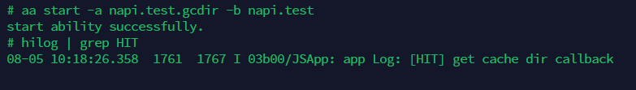

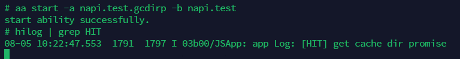

* context.getFilesDir [getFilesDir](https://developer.harmonyos.com/cn/docs/documentation/doc-references/js-apis-context-0000001155007622#section833813353294)

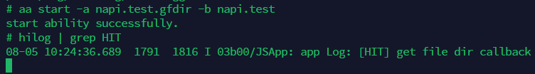

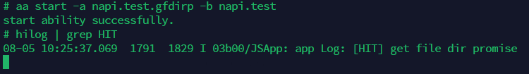

* context.getOrCreateLocalDir [getOrCreateLocalDir](https://developer.harmonyos.com/cn/docs/documentation/doc-references/js-apis-context-0000001155007622#section9297053217)

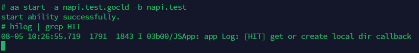


#### 2. 文件管理（fileio）

* fileio.access [access](https://developer.harmonyos.com/cn/docs/documentation/doc-references/js-apis-fileio-0000001168366687#section7992924105416)

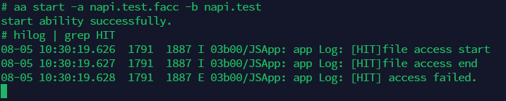

* fileio.accessSync [accessSync](https://developer.harmonyos.com/cn/docs/documentation/doc-references/js-apis-fileio-0000001168366687#section9627104782212)

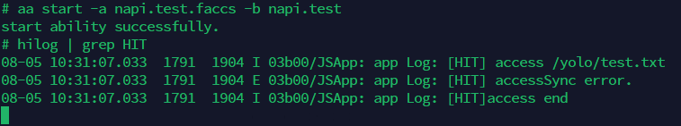

* fileio.mkdir [mkdir](https://developer.harmonyos.com/cn/docs/documentation/doc-references/js-apis-fileio-0000001168366687#section115231351102213)

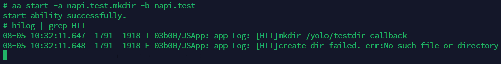

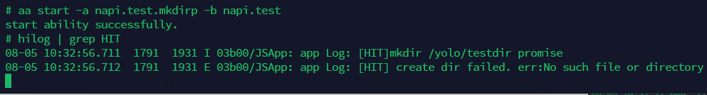

* fileio.mkdirSync [mkdirSync](https://developer.harmonyos.com/cn/docs/documentation/doc-references/js-apis-fileio-0000001168366687#section7429185420224)

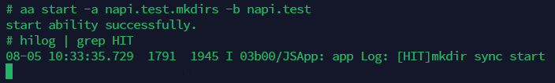

* fileio.open [open](https://developer.harmonyos.com/cn/docs/documentation/doc-references/js-apis-fileio-0000001168366687#section1153565865716)

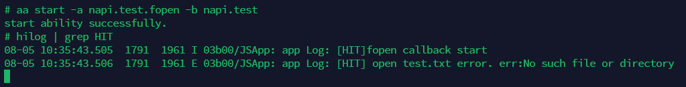

* fileio.openSync [openSync](https://developer.harmonyos.com/cn/docs/documentation/doc-references/js-apis-fileio-0000001168366687#section7431145402220)


#### 3. 文件存储（file）

* file.list [list](https://developer.harmonyos.com/cn/docs/documentation/doc-references/js-apis-file-storag-0000000000629445#section748711572018)

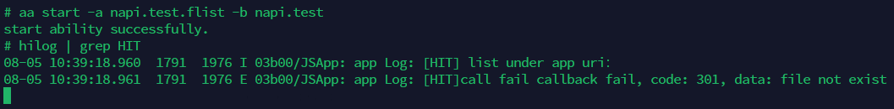

* file.access [access](https://developer.harmonyos.com/cn/docs/documentation/doc-references/js-apis-file-storag-0000000000629445#section184415510912)

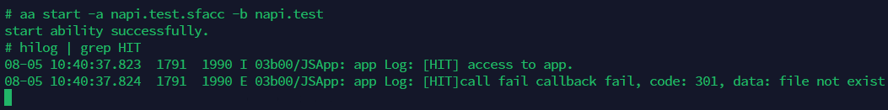

* file.mkdir [mkdir](https://developer.harmonyos.com/cn/docs/documentation/doc-references/js-apis-file-storag-0000000000629445#section134651459103)

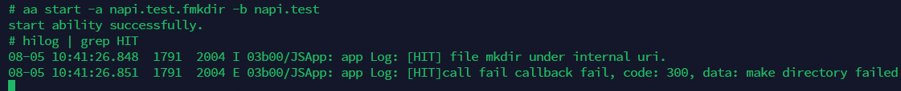

#### 4. 一次较完整的启动记录

```
08-05 10:41:26.638  1998  1998 I 01000/AbilityManagerService: [ability_command.cpp(AbilityManagerShellCommand:84)]argv_[3]: napi.test.fmkdir
08-05 10:41:26.638  1998  1998 I 01000/AbilityManagerService: [ability_command.cpp(AbilityManagerShellCommand:84)]argv_[5]: napi.test
08-05 10:41:26.643   445   445 D 01120/BundleMgrService: [inner_bundle_info.cpp(GetInnerBundleUserInfo):1928] no this user napi.test_0
08-05 10:41:26.644   445   445 D 01120/BundleMgrService: [bundle_data_mgr.cpp(QueryAbilityInfo):402] bundle name:napi.test, ability name:napi.test.fmkdir
08-05 10:41:26.644   445   445 D 01120/BundleMgrService: [bundle_data_mgr.cpp(ExplicitQueryAbilityInfo):466] bundleName:napi.test, abilityName:napi.test.fmkdir
08-05 10:41:26.644   445   445 D 01120/BundleMgrService: [bundle_data_mgr.cpp(GetInnerBundleInfoWithFlags):1409] GetInnerBundleInfoWithFlags: napi.test
08-05 10:41:26.644   445   445 D 01120/BundleMgrService: [inner_bundle_info.cpp(IsAbilityEnabled):1983] IsAbilityEnabled bundleName:napi.test, userId:100
08-05 10:41:26.644   445   445 D 01000/AbilityManagerService: [ability_manager_service.cpp(GenerateAbilityRequest:2585)]Query ability name: napi.test.fmkdir, is stage mode: 0
08-05 10:41:26.645   445   445 D 01000/AbilityManagerService: [ability_manager_service.cpp(GenerateAbilityRequest:2599)]End, app name: napi.test, bundle name: napi.test, uid: 20010033
08-05 10:41:26.645   445   445 D 01120/BundleMgrService: [bundle_mgr_host_impl.cpp(GetBundleInfo):91] start GetBundleInfo, bundleName : napi.test, flags : 32, userId : 100
08-05 10:41:26.646   445   445 D 01120/BundleMgrService: [inner_bundle_info.cpp(GetInnerBundleUserInfo):1928] no this user napi.test_0
08-05 10:41:26.646   445   445 D 01120/BundleMgrService: [bundle_data_mgr.cpp(GetInnerBundleInfoWithFlags):1409] GetInnerBundleInfoWithFlags: napi.test
08-05 10:41:26.647   445   445 D 01120/BundleMgrService: [inner_bundle_info.cpp(GetBundleWithAbilities):1733] bundleName:napi.test userid:100
08-05 10:41:26.647   445   445 D 01120/BundleMgrService: [bundle_data_mgr.cpp(GetBundleInfo):937] get bundleInfo(napi.test) successfully in user(100)
08-05 10:41:26.648   445   445 D 01000/AbilityManagerService: [ability_manager_service.cpp(StartAbilityInner:317)]StartAbilityInner PreLoadAppDataAbilities:napi.test
08-05 10:41:26.648   445   445 D 01120/BundleMgrService: [bundle_mgr_host_impl.cpp(GetBundleInfo):91] start GetBundleInfo, bundleName : napi.test, flags : 1, userId : 100
08-05 10:41:26.649   445   445 D 01120/BundleMgrService: [inner_bundle_info.cpp(GetInnerBundleUserInfo):1928] no this user napi.test_0
08-05 10:41:26.649   445   445 D 01120/BundleMgrService: [bundle_data_mgr.cpp(GetInnerBundleInfoWithFlags):1409] GetInnerBundleInfoWithFlags: napi.test
08-05 10:41:26.650   445   445 D 01120/BundleMgrService: [inner_bundle_info.cpp(GetBundleWithAbilities):1733] bundleName:napi.test userid:100
08-05 10:41:26.650   445   445 D 01120/BundleMgrService: [inner_bundle_info.cpp(IsAbilityEnabled):1983] IsAbilityEnabled bundleName:napi.test, userId:100
08-05 10:41:26.650   445   445 D 01120/BundleMgrService: [inner_bundle_info.cpp(IsAbilityEnabled):1983] IsAbilityEnabled bundleName:napi.test, userId:100
08-05 10:41:26.650   445   445 D 01120/BundleMgrService: [inner_bundle_info.cpp(IsAbilityEnabled):1983] IsAbilityEnabled bundleName:napi.test, userId:100
08-05 10:41:26.650   445   445 D 01120/BundleMgrService: [inner_bundle_info.cpp(IsAbilityEnabled):1983] IsAbilityEnabled bundleName:napi.test, userId:100
08-05 10:41:26.651   445   445 D 01120/BundleMgrService: [inner_bundle_info.cpp(IsAbilityEnabled):1983] IsAbilityEnabled bundleName:napi.test, userId:100
08-05 10:41:26.651   445   445 D 01120/BundleMgrService: [inner_bundle_info.cpp(IsAbilityEnabled):1983] IsAbilityEnabled bundleName:napi.test, userId:100
08-05 10:41:26.651   445   445 D 01120/BundleMgrService: [inner_bundle_info.cpp(IsAbilityEnabled):1983] IsAbilityEnabled bundleName:napi.test, userId:100
08-05 10:41:26.651   445   445 D 01120/BundleMgrService: [inner_bundle_info.cpp(IsAbilityEnabled):1983] IsAbilityEnabled bundleName:napi.test, userId:100
08-05 10:41:26.651   445   445 D 01120/BundleMgrService: [inner_bundle_info.cpp(IsAbilityEnabled):1983] IsAbilityEnabled bundleName:napi.test, userId:100
08-05 10:41:26.651   445   445 D 01120/BundleMgrService: [inner_bundle_info.cpp(IsAbilityEnabled):1983] IsAbilityEnabled bundleName:napi.test, userId:100
08-05 10:41:26.651   445   445 D 01120/BundleMgrService: [inner_bundle_info.cpp(IsAbilityEnabled):1983] IsAbilityEnabled bundleName:napi.test, userId:100
08-05 10:41:26.651   445   445 D 01120/BundleMgrService: [inner_bundle_info.cpp(IsAbilityEnabled):1983] IsAbilityEnabled bundleName:napi.test, userId:100
08-05 10:41:26.651   445   445 D 01120/BundleMgrService: [inner_bundle_info.cpp(IsAbilityEnabled):1983] IsAbilityEnabled bundleName:napi.test, userId:100
08-05 10:41:26.651   445   445 D 01120/BundleMgrService: [inner_bundle_info.cpp(IsAbilityEnabled):1983] IsAbilityEnabled bundleName:napi.test, userId:100
08-05 10:41:26.651   445   445 D 01120/BundleMgrService: [inner_bundle_info.cpp(IsAbilityEnabled):1983] IsAbilityEnabled bundleName:napi.test, userId:100
08-05 10:41:26.651   445   445 D 01120/BundleMgrService: [inner_bundle_info.cpp(IsAbilityEnabled):1983] IsAbilityEnabled bundleName:napi.test, userId:100
08-05 10:41:26.651   445   445 D 01120/BundleMgrService: [inner_bundle_info.cpp(IsAbilityEnabled):1983] IsAbilityEnabled bundleName:napi.test, userId:100
08-05 10:41:26.651   445   445 D 01120/BundleMgrService: [inner_bundle_info.cpp(IsAbilityEnabled):1983] IsAbilityEnabled bundleName:napi.test, userId:100
08-05 10:41:26.651   445   445 D 01120/BundleMgrService: [inner_bundle_info.cpp(IsAbilityEnabled):1983] IsAbilityEnabled bundleName:napi.test, userId:100
08-05 10:41:26.651   445   445 D 01120/BundleMgrService: [bundle_data_mgr.cpp(GetBundleInfo):937] get bundleInfo(napi.test) successfully in user(100)
08-05 10:41:26.652   445   445 I 01000/AbilityManagerService: [ability_manager_service.cpp(PreLoadAppDataAbilities:2824)]App data abilities preloading for bundle 'napi.test'...
08-05 10:41:26.652   445   445 I 01000/AbilityManagerService: [ability_connect_manager.cpp(StartAbilityLocked:101)]Start ability locked, ability_name: /napi.test/napi.test.fmkdir
08-05 10:41:26.653   445  1337 D 01120/BundleMgrService: [bundle_mgr_host_impl.cpp(GetBundleInfo):91] start GetBundleInfo, bundleName : napi.test, flags : 0, userId : 100
08-05 10:41:26.654   445  1337 D 01120/BundleMgrService: [inner_bundle_info.cpp(GetInnerBundleUserInfo):1928] no this user napi.test_0
08-05 10:41:26.654   445  1337 D 01120/BundleMgrService: [bundle_data_mgr.cpp(GetInnerBundleInfoWithFlags):1409] GetInnerBundleInfoWithFlags: napi.test
08-05 10:41:26.656   445  1337 D 01120/BundleMgrService: [inner_bundle_info.cpp(GetBundleWithAbilities):1733] bundleName:napi.test userid:100
08-05 10:41:26.656   445  1337 D 01120/BundleMgrService: [bundle_data_mgr.cpp(GetBundleInfo):937] get bundleInfo(napi.test) successfully in user(100)
08-05 10:41:26.656   445  1337 D 01120/BundleMgrService: [bundle_data_mgr.cpp(GetHapModuleInfo):1238] GetHapModuleInfo napi.test
08-05 10:41:26.656   445  1337 D 01120/BundleMgrService: [inner_bundle_info.cpp(GetInnerBundleUserInfo):1928] no this user napi.test_-1
08-05 10:41:26.657   445  1337 D 01120/BundleMgrService: [inner_bundle_info.cpp(GetInnerBundleUserInfo):1928] no this user napi.test_-1
08-05 10:41:26.657   445  1337 D 01120/BundleMgrService: [inner_bundle_info.cpp(GetInnerBundleUserInfo):1928] no this user napi.test_-1
08-05 10:41:26.657   445  1337 D 01120/BundleMgrService: [inner_bundle_info.cpp(GetInnerBundleUserInfo):1928] no this user napi.test_-1
08-05 10:41:26.657   445  1337 D 01120/BundleMgrService: [inner_bundle_info.cpp(GetInnerBundleUserInfo):1928] no this user napi.test_-1
08-05 10:41:26.657   445  1337 D 01120/BundleMgrService: [inner_bundle_info.cpp(GetInnerBundleUserInfo):1928] no this user napi.test_-1
08-05 10:41:26.657   445  1337 D 01120/BundleMgrService: [inner_bundle_info.cpp(GetInnerBundleUserInfo):1928] no this user napi.test_-1
08-05 10:41:26.657   445  1337 D 01120/BundleMgrService: [inner_bundle_info.cpp(GetInnerBundleUserInfo):1928] no this user napi.test_-1
08-05 10:41:26.657   445  1337 D 01120/BundleMgrService: [inner_bundle_info.cpp(GetInnerBundleUserInfo):1928] no this user napi.test_-1
08-05 10:41:26.657   445  1337 D 01120/BundleMgrService: [inner_bundle_info.cpp(GetInnerBundleUserInfo):1928] no this user napi.test_-1
08-05 10:41:26.657   445  1337 D 01120/BundleMgrService: [inner_bundle_info.cpp(GetInnerBundleUserInfo):1928] no this user napi.test_-1
08-05 10:41:26.657   445  1337 D 01120/BundleMgrService: [inner_bundle_info.cpp(GetInnerBundleUserInfo):1928] no this user napi.test_-1
08-05 10:41:26.657   445  1337 D 01120/BundleMgrService: [inner_bundle_info.cpp(GetInnerBundleUserInfo):1928] no this user napi.test_-1
08-05 10:41:26.657   445  1337 D 01120/BundleMgrService: [inner_bundle_info.cpp(GetInnerBundleUserInfo):1928] no this user napi.test_-1
08-05 10:41:26.657   445  1337 D 01120/BundleMgrService: [inner_bundle_info.cpp(GetInnerBundleUserInfo):1928] no this user napi.test_-1
08-05 10:41:26.657   445  1337 D 01120/BundleMgrService: [inner_bundle_info.cpp(GetInnerBundleUserInfo):1928] no this user napi.test_-1
08-05 10:41:26.657   445  1337 D 01120/BundleMgrService: [inner_bundle_info.cpp(GetInnerBundleUserInfo):1928] no this user napi.test_-1
08-05 10:41:26.658   445  1337 D 01120/BundleMgrService: [inner_bundle_info.cpp(GetInnerBundleUserInfo):1928] no this user napi.test_-1
08-05 10:41:26.658   445  1337 D 01120/BundleMgrService: [inner_bundle_info.cpp(GetInnerBundleUserInfo):1928] no this user napi.test_-1
08-05 10:41:26.658   445  1337 I 01110/AppMgrService: [app_mgr_service_inner.cpp(LoadAbility:143)]processName = [napi.test]
08-05 10:41:26.658   445  1337 I 01110/AppMgrService: [app_running_manager.cpp(CheckAppRunningRecordIsExist:69)]CheckAppRunningRecordIsExist appName : napi.test | processName : napi.test | uid : 20010033
08-05 10:41:26.658   445  1337 I 01110/AppMgrService: [app_running_manager.cpp(CheckAppRunningRecordIsExist:92)]appRecord->GetProcessName() : napi.test
08-05 10:41:26.658   445  1337 I 01110/AppMgrService: [app_running_manager.cpp(operator():96)]appInfo->name : napi.test
08-05 10:41:26.659   445  1337 I 01110/AppMgrService: [module_running_record.cpp(LaunchAbility:178)]ScheduleLaunchAbility ability:napi.test.fmkdir
08-05 10:41:26.662  1791  1793 I 01150/AppkitNative: [main_thread.cpp(ScheduleLaunchAbility:449)]MainThread::scheduleLaunchAbility, AbilityInfo name:napi.test.fmkdir type:2
08-05 10:41:26.664  1791  1793 D 01120/BundleMgrService: [bundle_mgr_proxy.cpp(GetBundleInfo):198] begin to get bundle info of napi.test
08-05 10:41:26.664   445   548 I 01120/BundleMgrService: [bundle_mgr_host.cpp(HandleGetBundleInfo):409] name napi.test, flag 0
08-05 10:41:26.664   445   548 D 01120/BundleMgrService: [bundle_mgr_host_impl.cpp(GetBundleInfo):91] start GetBundleInfo, bundleName : napi.test, flags : 0, userId : -2
08-05 10:41:26.666   445   548 D 01120/BundleMgrService: [bundle_data_mgr.cpp(GetInnerBundleInfoWithFlags):1409] GetInnerBundleInfoWithFlags: napi.test
08-05 10:41:26.667   445   548 D 01120/BundleMgrService: [inner_bundle_info.cpp(GetBundleWithAbilities):1733] bundleName:napi.test userid:100
08-05 10:41:26.667   445   548 D 01120/BundleMgrService: [bundle_data_mgr.cpp(GetBundleInfo):937] get bundleInfo(napi.test) successfully in user(-2)
08-05 10:41:26.692   445   548 I 01000/AbilityManagerService: [ability_connect_manager.cpp(AttachAbilityThreadLocked:351)]Ability: /napi.test/napi.test.fmkdir
08-05 10:41:26.693   445  1337 I 01000/AbilityManagerService: [ability_connect_manager.cpp(OnAbilityRequestDone:366)]Ability: /napi.test/napi.test.fmkdir
08-05 10:41:26.694   445  1337 D 01110/AppMgrService: [app_mgr_service_inner.cpp(StateChangedNotifyObserver:1185)]bundle:napi.test, ability:napi.test.fmkdir, state:2, pid:1791,uid:20010033, abilityType:2
08-05 10:41:26.694  1791  1793 I 02200/Ability: [operation.cpp(DumpInfo:378)]===Operation::abilityName_ napi.test.fmkdir =============
08-05 10:41:26.694  1791  1793 I 02200/Ability: [operation.cpp(DumpInfo:380)]===Operation::bundleName_ napi.test =============
08-05 10:41:26.695   445  1337 D 01110/AppMgrService: [app_mgr_service_inner.cpp(OnAppStateChanged:1105)]OnForegroundApplicationChanged, size:5, name:napi.test, uid:20010033, state:2
08-05 10:41:26.695   338   444 D 01700/CgroupEventHandler: HandleAbilityStateChanged : 20010033, 1791, napi.test, napi.test.fmkdir, 2, 2
08-05 10:41:26.696   338   444 D 01700/CgroupEventHandler: HandleForegroundApplicationChanged : 20010033, napi.test, 2
08-05 10:41:26.696   341  1008 I 01100/MemMgr: AppStateObserver::OnAbilityStateChanged called, uid=20010033, pid=1791, bundleName=napi.test FOREGROUND
08-05 10:41:26.697   341  1040 I 01100/MemMgr: BundlePriorityInfo::UpdatePriority bundleName=napi.test, priority=0
08-05 10:41:26.698   341  1050 I 01100/MemMgr: ReclaimStrategyManager::HandleAppStateChanged_ pid:1791 bundle:20010033 napi.test userId:100 score:0 action:APP_FOREGROUND
08-05 10:41:26.698   341  1008 I 01100/MemMgr: AppStateObserver::OnForegroundApplicationChanged uid=20010033, bundleName=napi.test, state=2, 
08-05 10:41:26.698  1791  1791 I 01120/BundleMgrService: [bundle_mgr_proxy.cpp(GetHapModuleInfo):927] begin to GetHapModuleInfo of napi.test
08-05 10:41:26.700   445   548 D 01120/BundleMgrService: [bundle_data_mgr.cpp(GetHapModuleInfo):1238] GetHapModuleInfo napi.test
08-05 10:41:26.719   445   548 D 01120/BundleMgrService: [bundle_data_mgr.cpp(QueryAbilityInfos):437] bundle name:napi.test, ability name:napi.test.fmkdir
08-05 10:41:26.719   445   548 D 01120/BundleMgrService: [bundle_data_mgr.cpp(ExplicitQueryAbilityInfo):466] bundleName:napi.test, abilityName:napi.test.fmkdir
08-05 10:41:26.719   445   548 D 01120/BundleMgrService: [bundle_data_mgr.cpp(GetInnerBundleInfoWithFlags):1409] GetInnerBundleInfoWithFlags: napi.test
08-05 10:41:26.719   445   548 D 01120/BundleMgrService: [inner_bundle_info.cpp(IsAbilityEnabled):1983] IsAbilityEnabled bundleName:napi.test, userId:100
08-05 10:41:26.727   445   548 D 01000/AbilityManagerService: [ability_manager_service.cpp(AbilityTransitionDone:2203)]state:1  name:napi.test.fmkdir
08-05 10:41:26.727   445   548 I 01000/AbilityManagerService: [ability_connect_manager.cpp(AbilityTransitionDone:404)]Ability: /napi.test/napi.test.fmkdir, state: INACTIVE
08-05 10:41:26.728   445  1337 D 01110/AppMgrService: [app_mgr_service_inner.cpp(StateChangedNotifyObserver:1185)]bundle:napi.test, ability:napi.test.fmkdir, state:0, pid:1791,uid:20010033, abilityType:2
08-05 10:41:26.730   341   341 I 01100/MemMgr: AppStateObserver::OnAbilityStateChanged called, uid=20010033, pid=1791, bundleName=napi.test Skiped!
08-05 10:41:26.732   445   548 D 01000/AbilityManagerService: [ability_connect_manager.cpp(ScheduleCommandAbilityDoneLocked:521)]Ability: /napi.test/napi.test.fmkdir
08-05 10:41:26.734   338   444 D 01700/CgroupEventHandler: HandleAbilityStateChanged : 20010033, 1791, napi.test, napi.test.fmkdir, 0, 2
08-05 10:41:26.847  1791  2004 I 02200/Ability: [napi_common_want.cpp(WrapElementName:70)]WrapElementName called. GetBundleName=napi.test
08-05 10:41:26.847  1791  2004 I 02200/Ability: [napi_common_want.cpp(WrapElementName:75)]WrapElementName called. GetAbilityName=napi.test.fmkdir
08-05 10:42:00.008   445   445 D 01120/BundleMgrService: [inner_bundle_info.cpp(GetInnerBundleUserInfo):1928] no this user napi.test_0
08-05 10:42:00.029   445  1277 D 01120/BundleMgrService: [bundle_data_mgr.cpp(GetInnerBundleInfoWithFlags):1409] GetInnerBundleInfoWithFlags: napi.test
```

PS： /data/log/faultlog/faultlogger 中没有一个fault记录

### 3.2 beta

由于之前怀疑是运行时在3.1 release时仍存在一定问题，所以在测试问题时同时制作了当前最新的3.2 beta文件系统，发现运行记录相比更加完整，但是仍无法找到确切问题所在，且运行时报错无法解决，如下图Error message信息，基本上所有无法正常输出的API接口，jscrash原因均相同

```
Error message: Obj is not a valid object
Cannot get SourceMap info, dump raw stack.
```

#### 1. Ability上下文（context）

* context.getCacheDir [getCacheDir](https://developer.harmonyos.com/cn/docs/documentation/doc-references/js-apis-context-0000001155007622#section11170623297)

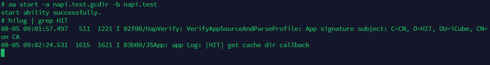
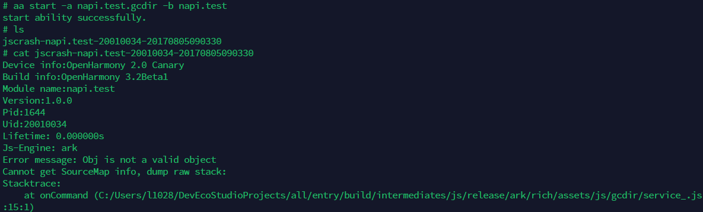

* context.getFilesDir [getFilesDir](https://developer.harmonyos.com/cn/docs/documentation/doc-references/js-apis-context-0000001155007622#section833813353294)


* context.getOrCreateLocalDir [getOrCreateLocalDir](https://developer.harmonyos.com/cn/docs/documentation/doc-references/js-apis-context-0000001155007622#section9297053217)


#### 2. 文件管理（fileio）

* fileio.access [access](https://developer.harmonyos.com/cn/docs/documentation/doc-references/js-apis-fileio-0000001168366687#section7992924105416)


* fileio.accessSync [accessSync](https://developer.harmonyos.com/cn/docs/documentation/doc-references/js-apis-fileio-0000001168366687#section9627104782212)


* fileio.mkdir [mkdir](https://developer.harmonyos.com/cn/docs/documentation/doc-references/js-apis-fileio-0000001168366687#section115231351102213)


* fileio.mkdirSync [mkdirSync](https://developer.harmonyos.com/cn/docs/documentation/doc-references/js-apis-fileio-0000001168366687#section7429185420224)


* fileio.open [open](https://developer.harmonyos.com/cn/docs/documentation/doc-references/js-apis-fileio-0000001168366687#section1153565865716)


* fileio.openSync [openSync](https://developer.harmonyos.com/cn/docs/documentation/doc-references/js-apis-fileio-0000001168366687#section7431145402220)


#### 3. 文件存储（file）

* file.list [list](https://developer.harmonyos.com/cn/docs/documentation/doc-references/js-apis-file-storag-0000000000629445#section748711572018)


* file.access [access](https://developer.harmonyos.com/cn/docs/documentation/doc-references/js-apis-file-storag-0000000000629445#section184415510912)


* file.mkdir [mkdir](https://developer.harmonyos.com/cn/docs/documentation/doc-references/js-apis-file-storag-0000000000629445#section134651459103)

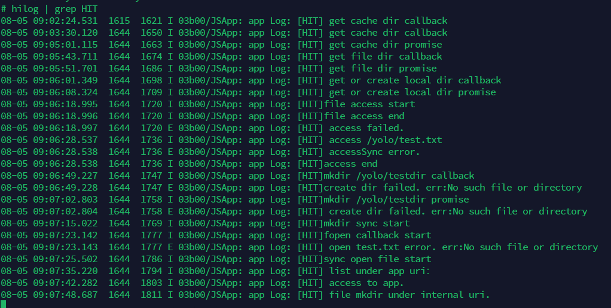

#### 4. 较完整的启动记录

```
# hilog | grep napi.test                                                                                                                                                                                          
08-05 09:11:37.578  1838  1838 I 01000/AbilityManagerService: [ability_command.cpp(AbilityManagerShellCommand:74)]argv_[3]: napi.test.sfacc
08-05 09:11:37.578  1838  1838 I 01000/AbilityManagerService: [ability_command.cpp(AbilityManagerShellCommand:74)]argv_[5]: napi.test
08-05 09:11:37.587   511   511 I 01000/AbilityManagerService: [ability_manager_service.cpp(PreLoadAppDataAbilities:2744)]App data abilities preloading for bundle 'napi.test'...
08-05 09:11:37.587   511   511 I 01000/AbilityManagerService: [ability_connect_manager.cpp(StartAbilityLocked:100)]Start ability locked, ability_name: /napi.test/napi.test.sfacc
08-05 09:11:37.588   511  1285 I 01110/AppMgrService: [app_mgr_service_inner.cpp(LoadAbility:132)]AppMgrService start loading ability, name is napi.test.sfacc.
08-05 09:11:37.592   511  1285 I 01110/AppMgrService: [app_running_manager.cpp(CheckAppRunningRecordIsExist:79)]appName: napi.test, processName: napi.test, uid : 20010034
08-05 09:11:37.592   511  1285 I 01110/AppMgrService: [app_running_manager.cpp(CreateAppRunningRecord:68)]Create AppRunningRecord, processName: napi.test, recordId: 12
08-05 09:11:37.609   511  1285 I 01110/AppMgrService: [app_spawn_msg_wrapper.cpp(DumpMsg:136)]uid: 20010034, gid: 20010034, procName: napi.test
08-05 09:11:37.611   241   241 I 0a011/APPSPAWN: [appspawn_service.c:327]OnReceiveRequest client.id 12 appProperty 20010034 processname napi.test buffLen 2108 flags 0x0
08-05 09:11:37.622  1844  1844 I 02d0a/HiDebug_Native: napi.test debug params not found.
08-05 09:11:37.627  1844  1844 E 00000/AppSpawn_SandboxUtil: CheckAppSandboxSwitchStatus total start, napi.test
08-05 09:11:37.627  1844  1844 E 00000/AppSpawn_SandboxUtil: CheckAppSandboxSwitchStatus start, napi.test
08-05 09:11:37.632  1844  1844 E 00000/AppSpawn_SandboxUtil: CheckAppSandboxSwitchStatus start, napi.test
08-05 09:11:37.632  1844  1844 E 00000/AppSpawn_SandboxUtil: CheckAppSandboxSwitchStatus total start, napi.test
08-05 09:11:37.636  1844  1844 I 0a011/APPSPAWN: [appspawn_service.c:381]NotifyResToParent napi.test fd 12 result 0
08-05 09:11:37.637   241   241 I 0a011/APPSPAWN: [appspawn_service.c:338]child process napi.test success pid 1844
08-05 09:11:37.637   241   241 I 0a011/APPSPAWN: [appspawn_service.c:93]Add napi.test, pid=1844 success
08-05 09:11:37.638   511  1285 I 01110/AppMgrService: [app_mgr_service_inner.cpp(StartProcess:1296)]Start process success, pid is 1844, processName is napi.test.
08-05 09:11:37.638   511  1285 I 01110/AppMgrService: [app_mgr_service_inner.cpp(OnAppStateChanged:1121)]OnApplicationStateChanged, name:napi.test, uid:20010034, state:0
08-05 09:11:37.644   298   592 I 01100/MemMgr: ReclaimStrategyManager::HandleProcessCreate_ succ, pid:1844 bundle:20010034 napi.test userId:100 score:0 action:CREATE_PROCESS_AND_APP
08-05 09:11:37.655   511  1285 I 01110/AppMgrService: [app_running_record.cpp(LaunchApplication:333)]Schedule launch application, app is napi.test.
08-05 09:11:37.656   511  1285 I 01110/AppMgrService: [module_running_record.cpp(LaunchAbility:177)]Schedule launch ability, name is napi.test.sfacc.
08-05 09:11:37.658  1844  1844 I 01150/AppkitNative: [main_thread.cpp(LoadAbilityLibrary:1653)]MainThread::LoadAbilityLibrary Try to scanDir /data/storage/el1/bundle/napi.test
08-05 09:11:37.658  1844  1844 E 01150/AppkitNative: [main_thread.cpp(ScanDir:1723)]MainThread::ScanDir open dir:/data/storage/el1/bundle/napi.test/libs fail
08-05 09:11:37.658  1844  1844 I 01150/AppkitNative: [main_thread.cpp(LoadAbilityLibrary:1659)]MainThread::LoadAbilityLibrary scanDir /data/storage/el1/bundle/napi.test/libs not exits
08-05 09:11:37.659  1844  1845 I 01150/AppkitNative: [main_thread.cpp(ScheduleLaunchAbility:452)]MainThread schedule launch ability, name is napi.test.sfacc, type is 2.
08-05 09:11:37.662   511   511 I 01120/BundleMgrService: [bundle_mgr_host.cpp(HandleGetBundleInfo):418] name napi.test, flag 0
08-05 09:11:37.671   511  1830 I 01120/BundleMgrService: [bundle_mgr_host.cpp(HandleGetBundleInfo):418] name napi.test, flag 0
08-05 09:11:37.717  1844  1844 I 01150/AppkitNative: [main_thread.cpp(InitResourceManager:734)]MainThread::handleLaunchApplication length: 63, moduleResPath: /data/storage/el1/bundle/napi.test/assets/entry/resources.index
08-05 09:11:37.734  1844  1844 I 01120/BundleMgrService: [bundle_mgr_proxy.cpp(GetHapModuleInfo):1080] begin to GetHapModuleInfo of napi.test
08-05 09:11:37.764  1844  1844 I 02200/Ability: [ability_thread.cpp(Attach:212)]Attach ability begin, ability:napi.test.sfacc.
08-05 09:11:37.768   511  1830 I 01000/AbilityManagerService: [ability_connect_manager.cpp(AttachAbilityThreadLocked:354)]Ability: /napi.test/napi.test.sfacc
08-05 09:11:37.768   511  1830 I 01000/AbilityManagerService: [ability_record.cpp(Inactivate:461)]Inactivate ability start, ability:napi.test.sfacc.
08-05 09:11:37.769  1844  1845 I 02200/Ability: [ability_thread.cpp(ScheduleAbilityTransaction:724)]Schedule ability transaction, name is napi.test.sfacc, targeState is 1, isNewWant is 0.
08-05 09:11:37.769  1844  1844 I 02200/Ability: [ability_thread.cpp(HandleAbilityTransaction:441)]Handle ability transaction begin, name is napi.test.sfacc.
08-05 09:11:37.769  1844  1844 I 02200/Ability: [ability.cpp(OnStart:213)]OnStart begin, ability is napi.test.sfacc.
08-05 09:11:37.772  1844  1844 I 01120/BundleMgrService: [bundle_mgr_proxy.cpp(GetHapModuleInfo):1080] begin to GetHapModuleInfo of napi.test
08-05 09:11:37.822   511  1830 I 01000/AbilityManagerService: [ability_connect_manager.cpp(AbilityTransitionDone:407)]Ability: /napi.test/napi.test.sfacc, state: INACTIVE
```

相比3.1 Release版本，3.2 beta的hilog调试信息可读性更好一些

## 其他

附HAP工程于all目录，签名和证书于ohosKey_xc目录，bundle_name: napi.test
